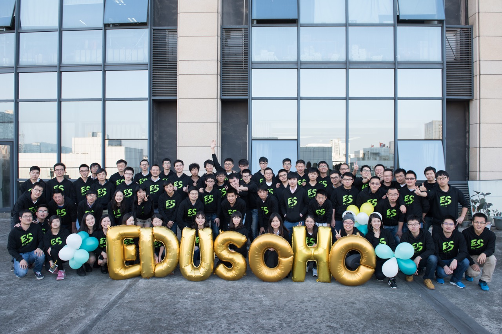
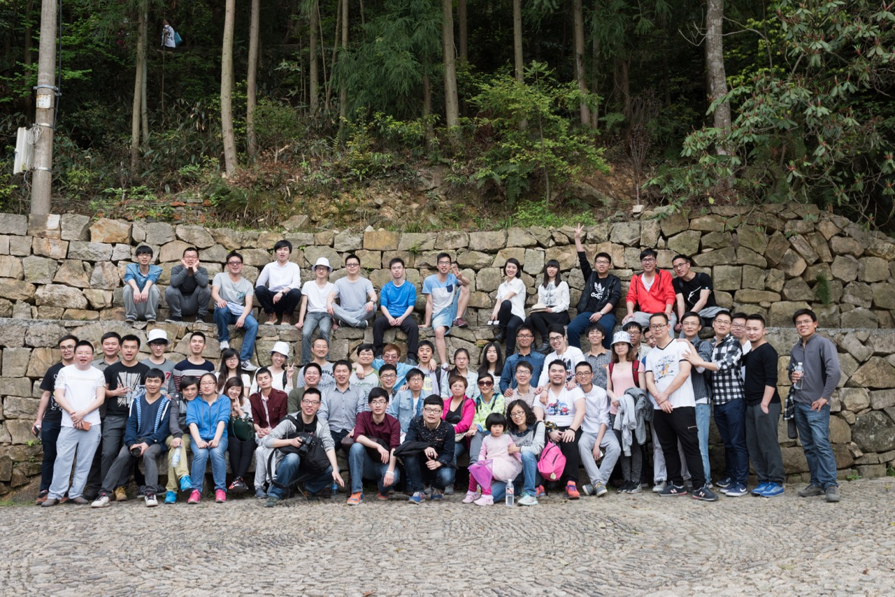
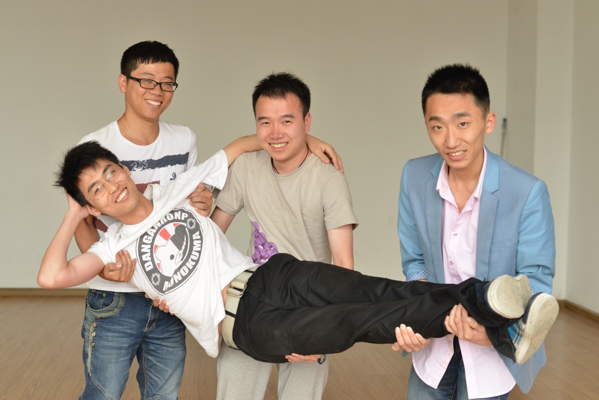
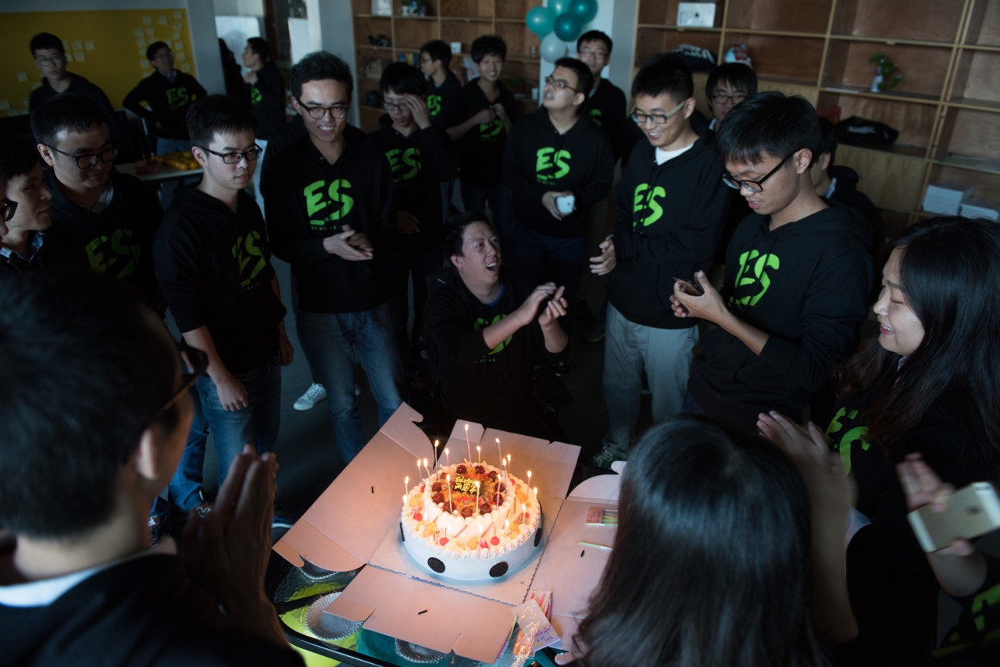

# Work At EduSoho

## 公司简介

教育改变世界，而网络改变教育。杭州阔知网络科技有限公司是一家专注在线教育的互联网公司，协助各类培训机构和学校建立在线教育网站。EduSoho自推出后，获得了众多用户的认可，现已覆盖大学、中小学、培训机构、军队以及企业内训等多个领域。主要产品有：

  * [EduSoho开源网络课堂](https://github.com/EduSoho/EduSoho)
    微课、直播、题库、问答、自媒体社区、全功能在线教育网络课堂系统。
  * [EduSoho教育云](http://open.edusoho.com)
    为网校提供云视频、云直播、云文档、云短信、云邮件等云服务。目前，已为20000家使用EduSoho开源网络课堂的在线教育机构接入教育云，约800万学员从中受益。

公司位于浙江杭州的滨江区。[杭州市](https://zh.wikipedia.org/wiki/%E6%9D%AD%E5%B7%9E%E5%B8%82)，简称杭，浙江省省会，位于中国东南沿海、浙江省北部、钱塘江下游、京杭大运河南端，是浙江省的政治、经济、文化和金融中心，中国七大古都之一，中国重要的电子商务中心之一。

杭州以风景秀丽著称，素有“上有天堂，下有苏杭”的美誉。市内人文古迹众多，西湖及其周边有大量的自然及人文景观遗迹。杭州是吴越文化的发源地之一，历史文化积淀深厚。其中主要代表性的独特文化有良渚文化、丝绸文化、茶文化、以及流传下来的许多故事传说成为杭州文化代表。

## 关于团队

目前公司人员100人，由一群富有朝气的年轻人组成，因为对于在线教育的兴趣而聚集在一起。由于在线教育的蓬勃发展和市场拓展的需求，现我们诚挚邀请对于在线教育感兴趣的成员加入我们的团队，一起投入这个能够改变世界的领域。

我们崇尚**简单**、**快乐**、**健康**、**分享**的团队文化。 来吧，全世界的程序员们，来加入我们吧！

**[简历投递]**

wellming.li@howzhi.com

**[联系电话]**

086-0571-86819929

**[联系地址]**

浙江省杭州市滨江区源越大厦３层

## 招聘职位

### 大数据架构师

**[岗位职责]**
  * 参与公司大数据平台架构、大数据分析产品的规划、设计、研发工作；
  * 负责大数据核心技术，确定技术方案和系统框架设计；
  * 对大数据BI领域内的世界前沿技术及发展趋势敏感，有清晰的认知，能引领大数据发展方向；
  * 带领团队进行大数据领域的技术难点攻关，并能指导数据平台的设计。

**[岗位要求]**
  * 精通Java开发，3年及以上大数据从业经验；
  * 精通常见的开源分布式计算/存储相关技术，包括但不限于YARN，MapReduce，Impala，Spark，Kafaka等；
  * 算法基础扎实，掌握数据仓库(DW)/ 商业智能(BI)/ 数据统计理论，并灵活的应用；
  * 有互联网产品BI开发经验，有网站数据、用户数据、点击流、精准营销等相关经验；
  * 具有良好的商业敏感度和优秀的数据分析技能，能够开发创新而实际的分析方法以解决复杂的商业问题。

### 大数据研发工程师

**[岗位职责]**
  * 负责公司大数据平台和大数据核心产品研发；
  * 参与公司大数据平台应用及规划。

**[岗位要求]**
  * 2年以上工作经验：熟悉大数据相关技术，有良好的Java基础、至少有1年及以上的开发经验；
  * 了解整个大数据生态圈组件如HDFS、HBase、Hive、Impala、Spark、Kafka、Storm等；
  * 熟悉推荐算法，并有相关开发经验者优先；
  * 良好的逻辑思维能力，能够从海量数据中发现有价值的规律，对数据敏感，能够发现关键数据、发现关键问题；
  * 良好的沟通能力、团队精神和服务意识。

### 视频高级工程师

**[岗位职责]**

音视频加解密算法、网络传输的研究与实现；视频场景化图像压缩优化；视频图像识别技术的研究与实现；视频点播、直播云的架构与开发。

**[岗位要求]**

  * 精通C/C++，3年以上开发经验；
  * 熟悉H264、VP8等视频编码原理，熟悉x264、FFmpeg、WebRTC等开源项目，并能基于其框架进行开发；
  * 深入了解音视频压缩编解码、噪音抑制、回声消除、图像增强等技术；
  * 熟悉基于H.264的采集优化，渲染和前后处理，音视频网络传输QoS反馈；
  * 良好的沟通能力、团队精神和服务意识。

### 前端架构师

**[岗位职责]**

负责公司多条产品线的前端架构，开发流程改进，以及前端队伍的建设，新技术的推进。

**[岗位要求]**

  * 三年以上前端大型工程研发经验, 精通React/Webpack/NodeJS等技术；
  * 对前端开发规范、工程化、组件化、测试有深入认识和实践；
  * 深刻理解产品研发流程，能够推动整个研发流程进行优化；
  * 对新技术保持敏感和好奇心, 并能推动在产品中应用；
  * 个性乐观开朗，逻辑性强，良好的沟通协调能力；
  * 具备敏捷管理经验。

### PHP高级工程师

**[岗位职责]**

负责EduSoho的架构设计与研发( https://github.com/EduSoho/EduSoho )。

**[岗位要求]**

  * 具备较强的逻辑思维能力
  * 精通PHP语言开发
  * 熟练掌握设计模式、重构
  * 熟练掌握MySQL的使用，知晓MySQL的特性、性能调优
  * 熟练掌握jQuery开发以及jQuery插件的编写
  * 熟练使用Git、Linux。

### 高级运维工程师

**[岗位职责]**

  * 负责运维流程规划、设计、推行和持续优化，构建高效的自动化运维体系； 
  * 负责建设监控系统，以及日志分析。 
  * 带领团队完成平台服务器日常维护、故障处理，并建立突发情况快速响应机制。

**[岗位要求]**

  * 有大型互联网服务网站生产环境架构上线部署和搭建工作，有实际线上生产环境运维经验至少3年以上；
  * 具备快速诊断，解决疑难问题的能力； 
  * 熟悉自动化运维工具，熟练编写shell脚本，熟悉Perl、Python、PHP任其一种语言能编写自动化运维脚本者；
  * 熟练掌握zabbix监控软件架构、原理；
  * 精通Linux；熟悉服务器软硬件，HA、负载均衡、存储设备、磁盘阵列；
  * 乐于不断学习新知识、新技术，并能快速领悟及运用。

